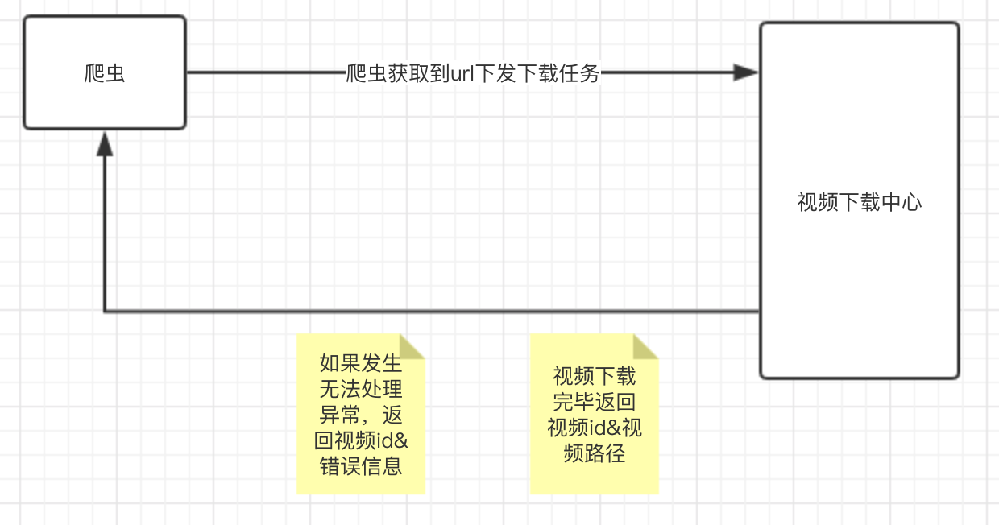

# YTB-
YTB通用在线下载中心


这个用于在线下载   不是Golang第三方组件



爬虫部分会设置安全服务器限制，如果超出服务器限制，返回错误信息，客户端需等待

### 一些定义信息
``` 

// 任务发下 发送对象 
type YouTuBeRsq struct {
	Id   string `json:"id" form:"id"`     // 视频id
	Name string `json:"name" form:"name"` // 动漫名称
	Url string `json:"url" form:"url"`   // url地址
}

// 任务下发 返回对象
type Task struct { // 任务下发时返回信息
	Code int `json:"code"`  // 代码 200正确 503服务器任务队列已满(客户端需等待)
	Msg int `json:"msg"`    // 消息
}

// 服务端 返回客户端对象
type M3U8Success struct {
	Id   string `json:"id" form:"id"`      // 视频id
	Path string `json:"path" form:"path"`  // 视频路径
	Msg  string `json:"msg" form:"msg"`    // 信息
	Code int    `json:"code" form:"code"`  // 判断码  200正常 500错误
}
```